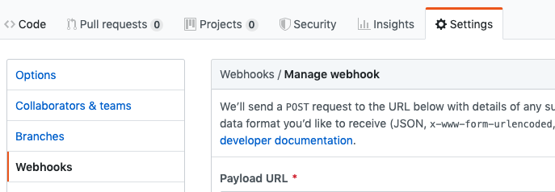

# Setup GitHub

## Webhook

The webhook used for receive git notification such as push, tag, pull request and so on.

1. Copy webhook url from flow settings
    > Hint: Your host must be exposed to internet (public ip or domain), otherwide the github events can not be received.
    > If pulbic ip or domain not availble in your environments, please use the tools like [ngrok](https://ngrok.com/).  

   

2. Open webhook from GitHub settings

   

3. Setup webhook

    - Payload URL

      Paste webhook url copied from flow settings (step 1)

      > If using `ngrok`, please replace wehbook url by ngrok, ex: `http://172.20.10.4/webhooks/spring-sample` to `http://7e9ea9dc.ngrok.io/webhooks/spring-sample`

    - Content type

      Select content type to `application/json`

    

4. Select events

    - Select `Let me select individual events`
    - Check events `push` and `pull request`

    

## Deploy Key
