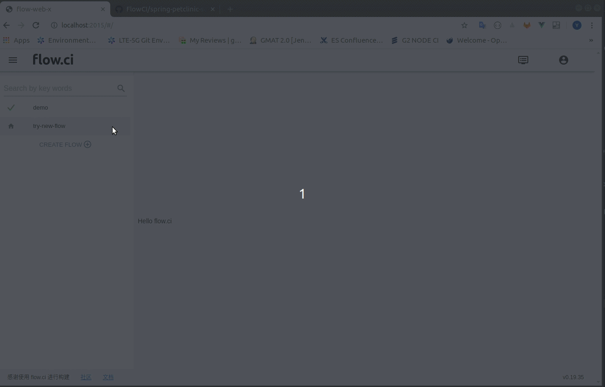

# Getting Started

## Create a flow (pipeline)

Steps to create flow

- Give a name
  - Click 'create flow' from left panel
  - Type a name for flow
  - The flow will be created directly without Git setup
  
- Git Setup (optional)
  
  > Optional step, it can be done from YML configuraiton after flow created

  - Config Git URL

    - `webhook`: url used for receive git events (push, tag, pull request), please using the url shown on 'Webhook' field.
    
    - `git url`: fill in repo remote url copied from git, support both `git@:` and `https://`
  
  - Config Git Access

    Generate new or use an existing ssh-rsa key. 

    - How to setup for [GitHub](../git/github.md)

  - Test Git Connection

    Click 'test' button to test git repo access right, or click 'finish' to create flow without test.

## Setup YAML

By default, flow.ci will create a sample yaml after the flow created, of course you could change it from UI.

For more detail of YAML configuration please go to [YAML Configuration]() chapter

## Start build
